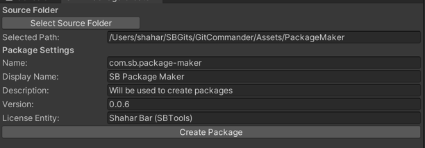

# SB Package Maker

Will be used to create upm packages

## Installation

To install this package, add the following line to the `dependencies` section of your project's `manifest.json` file:
"com.sb.package-maker": "https://github.com/shaharbar2/SBTools.git?path=/Packages/com.sb.package-maker#main"

## Features

- **User Interface:** Offers a simple and intuitive GUI within the Unity Editor for setting up and creating UPM packages.
- **Folder Selection:** Allows users to select the source folder containing the Unity project to be packaged.
- **Package Configuration:** Users can specify package details like name, display name, description, and version.
- **Automatic File Organization:** Classifies and organizes scripts into appropriate subfolders (Editor, Tests, Runtime) based on their content.
- **Package.json Generation:** Automatically generates a `package.json` file with the specified package details.
- **Assembly Definition Files:** Creates `.asmdef` files for different subfolders to ensure correct compilation and separation of code.
- **License and Readme:** Generates a standard MIT license file and a README.md for the package with installation instructions.

## How to Use

1. **Open SBPackageMaker:** In Unity, navigate to `SBTools > UPM Package Creator` to open the SBPackageMaker window.
2. **Select Source Folder:** Click on 'Select Source Folder' to choose the folder containing your Unity project.
3. **Configure Package:** Fill in the package details like name, display name, description, and version.
4. **Create Package:** Click on 'Create Package' to generate the UPM package in the designated output directory.

## Requirements

- Unity 2020.1 or higher.
- The tool must be placed within the Unity Editor project.

## Contributions

For improvements or bug reports, please reach out to the maintainer at `https://github.com/shaharbar2/SBTools`.
Feel free to fork and create Pull Requests.

## License

This tool is distributed under the MIT License. See the included LICENSE.md file for more details.
For more details about the license, see
[LICENSE.md](Packages%2Fcom.sb.package-maker%2FLICENSE.md)
